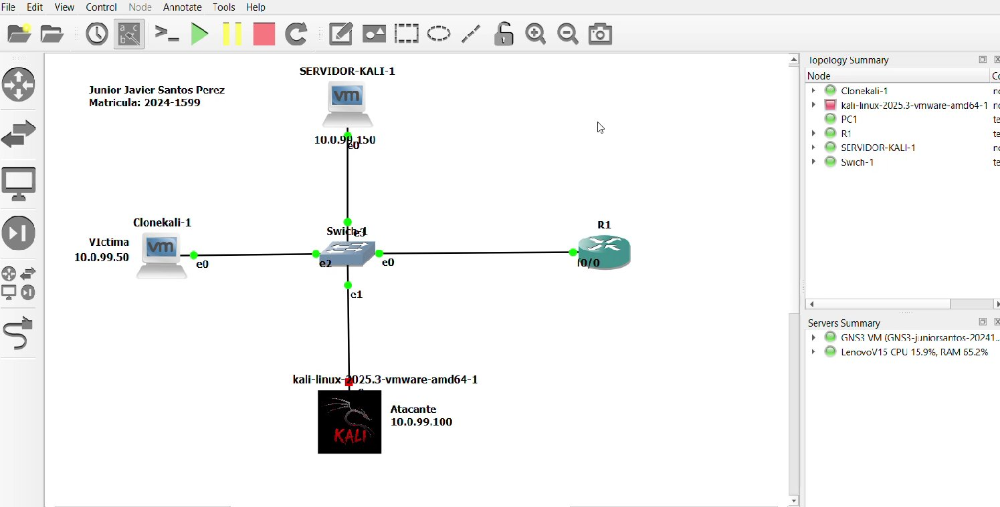
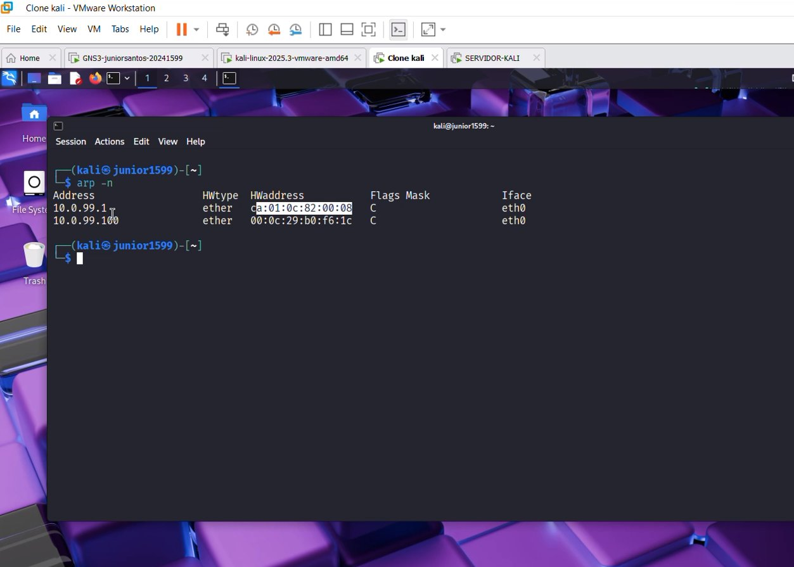
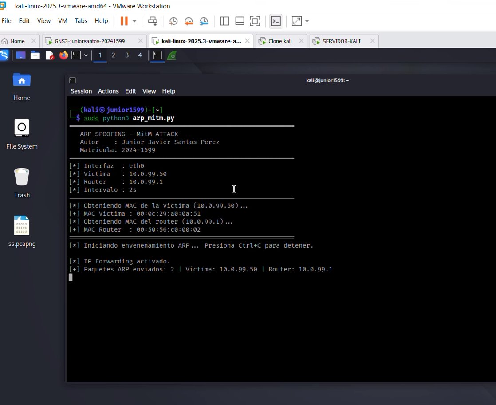
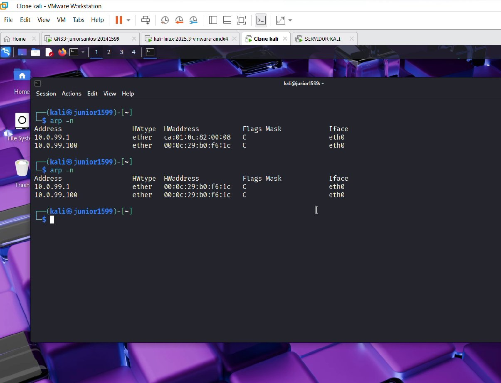
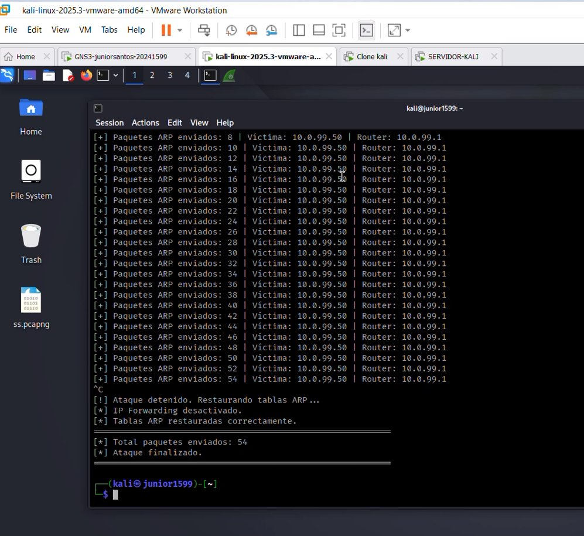
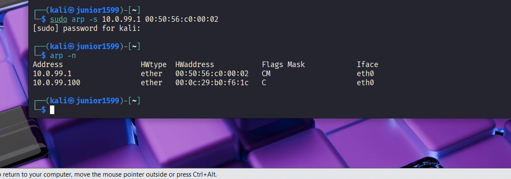

# 🛡️ Ataque MitM mediante ARP — Documentación Técnica

Autor: Junior Javier Santos Perez

Matrícula: 2024-1599

Herramienta: arp_mitm.py

Plataforma de laboratorio: GNS3 + Kali Linux 2025.3

Link video: https://www.youtube.com/watch?v=1hRtG_guLjI 

Enlace GitHub: https://github.com/juniorjaviersantosperez/MitM-mediante-ARP 

---

## 📋 Tabla de Contenidos

1. [Objetivo del Laboratorio](#objetivo-del-laboratorio)
2. [Objetivo del Script](#objetivo-del-script)
3. [Parámetros Utilizados](#parámetros-utilizados)
4. [Requisitos para el Uso de la Herramienta](#requisitos-para-el-uso-de-la-herramienta)
5. [Descripción del Funcionamiento del Script](#descripción-del-funcionamiento-del-script)
6. [Documentación de la Red](#documentación-de-la-red)
7. [Topología](#topología)
8. [Capturas de Pantalla](#capturas-de-pantalla)
9. [Medidas de Mitigación / Contramedidas](#medidas-de-mitigación--contramedidas)

---

## 🎯 Objetivo del Laboratorio

Demostrar de forma práctica y controlada la ejecución de un ataque **Man-in-the-Middle (MitM) mediante ARP Spoofing** sobre una red simulada en GNS3, con el fin de:

- Comprender el mecanismo de envenenamiento de caché ARP en redes IPv4.
- Observar cómo un atacante puede interceptar el tráfico entre una víctima y su gateway.
- Verificar el cambio en la tabla ARP de la víctima como evidencia del ataque.
- Proponer e implementar contramedidas efectivas para mitigar el ataque.

---

## 🐍 Objetivo del Script

El script `arp_mitm.py` tiene como objetivo ejecutar un ataque de **Man-in-the-Middle (MitM)** mediante el envenenamiento de la caché ARP de la víctima y del router. El propósito técnico es:

- **Envenenar la tabla ARP** de la víctima (`10.0.99.50`) haciéndole creer que la MAC del atacante corresponde a la IP del router (`10.0.99.1`).
- **Envenenar la tabla ARP** del router (`10.0.99.1`) haciéndole creer que la MAC del atacante corresponde a la IP de la víctima.
- **Activar IP Forwarding** en el atacante para que el tráfico interceptado siga fluyendo con normalidad (ataque transparente).
- Posicionar al atacante como intermediario invisible de toda la comunicación entre víctima y router.

---

## ⚙️ Parámetros Utilizados

| Parámetro      | Valor                     | Descripción                                              |
|----------------|---------------------------|----------------------------------------------------------|
| Interfaz       | `eth0`                    | Interfaz de red del atacante                             |
| Víctima        | `10.0.99.50`              | IP del host objetivo del envenenamiento                  |
| Router         | `10.0.99.1`               | IP del gateway predeterminado de la red                  |
| Intervalo      | `2s`                      | Tiempo entre cada envío de paquetes ARP falsos           |
| MAC Víctima    | `00:0c:29:a0:0a:51`       | MAC real de la víctima (obtenida automáticamente)        |
| MAC Router     | `00:50:56:c0:00:02`       | MAC real del router (obtenida automáticamente)           |
| IP Forwarding  | Activado                  | Permite reenvío de paquetes para mantener transparencia  |
| Total enviados | 54 paquetes ARP           | Total de respuestas ARP falsas inyectadas                |

---

## 🖥️ Requisitos para el Uso de la Herramienta

### Sistema Operativo
- Kali Linux 2025.3 (o cualquier distribución Linux con soporte a raw sockets)

### Privilegios
- Ejecución como `root` o con `sudo` (necesario para enviar paquetes ARP crudos y modificar IP Forwarding)

### Dependencias Python
```bash
# Requiere Scapy para construcción y envío de paquetes ARP
pip install scapy

# Módulos adicionales de la librería estándar:
import time
import threading
import subprocess
import os
```

### Hardware / Red
- Interfaz de red activa en el mismo segmento L2 que la víctima y el router
- Conectividad al mismo dominio de broadcast (misma VLAN / subred)

### Entorno de Laboratorio
- GNS3 con nodos Kali Linux (atacante y víctima)
- Router Cisco o equivalente como gateway
- Switch L2 conectando todos los nodos

---

## 🔬 Descripción del Funcionamiento del Script

El script opera en las siguientes fases:

### Fase 1 — Descubrimiento de MACs
El script resuelve automáticamente las direcciones MAC reales de la víctima y del router enviando solicitudes ARP y capturando las respuestas:
- **MAC Víctima** (`10.0.99.50`): `00:0c:29:a0:0a:51`
- **MAC Router** (`10.0.99.1`): `00:50:56:c0:00:02`

### Fase 2 — Activación de IP Forwarding
Se habilita el reenvío de paquetes IP en el kernel del atacante para que el tráfico interceptado continúe llegando a su destino legítimo, haciendo el ataque completamente transparente para la víctima:
```bash
echo 1 > /proc/sys/net/ipv4/ip_forward
```

### Fase 3 — Envenenamiento ARP Continuo
Cada **2 segundos** se envían dos paquetes ARP Reply falsos:
1. **A la víctima**: "La IP `10.0.99.1` (router) tiene la MAC `[MAC atacante]`"
2. **Al router**: "La IP `10.0.99.50` (víctima) tiene la MAC `[MAC atacante]`"

Esto posiciona al atacante como intermediario de toda la comunicación.

### Fase 4 — Interceptación del Tráfico
Con el envenenamiento activo, todo el tráfico entre la víctima y el router pasa por el atacante, quien puede:
- Capturarlo con herramientas como Wireshark o tcpdump
- Modificarlo en tránsito
- Leer credenciales en texto plano (HTTP, FTP, Telnet, etc.)

### Fase 5 — Finalización y Restauración
Al presionar `Ctrl+C`, el script:
1. Detiene el envenenamiento
2. Restaura las tablas ARP correctas tanto en la víctima como en el router
3. Desactiva el IP Forwarding
4. Muestra el resumen total de paquetes enviados

---

## 🌐 Documentación de la Red

### Tabla de Direccionamiento IP

| Nodo                              | Rol       | Interfaz | Dirección IP  | MAC                   |
|-----------------------------------|-----------|----------|---------------|-----------------------|
| kali-linux-2025.3-vmware-amd64-1  | Atacante  | eth0     | 10.0.99.100   | `00:0c:29:b0:f6:1c`   |
| Clonekali-1                       | Víctima   | e0       | 10.0.99.50    | `00:0c:29:a0:0a:51`   |
| SERVIDOR-KALI-1                   | Servidor  | e0       | 10.0.99.150   | —                     |
| Switch-1                          | Switch L2 | e0/e1/e2 | N/A (L2)      | —                     |
| R1                                | Router/GW | f0/0     | 10.0.99.1     | `00:50:56:c0:00:02`   |

### Protocolo Explotado

| Protocolo | Tipo    | Descripción                                                                 |
|-----------|---------|-----------------------------------------------------------------------------|
| ARP       | L2/L3   | Address Resolution Protocol — sin autenticación, vulnerable a spoofing      |

### Evidencia del Envenenamiento ARP

| Momento     | IP         | MAC registrada en víctima    | Estado         |
|-------------|------------|------------------------------|----------------|
| Antes        | 10.0.99.1  | `ca:01:0c:82:00:08` (real)   | Legítimo       |
| Durante/Después | 10.0.99.1 | `00:0c:29:b0:f6:1c` (atacante) | **Envenenado** |

---

## 🗺️ Topología

La topología fue diseñada e implementada en **GNS3** con los siguientes componentes:

```
    [SERVIDOR-KALI-1]
    10.0.99.150 / e0
          |
          | (e0 - Switch-1)
     [Switch-1]────────────────[R1 / Gateway]
          |  (e2)                   f0/0 — 10.0.99.1
          |
     (e0 - Clonekali-1)
    [Clonekali-1 / Víctima]
    10.0.99.50

     (e1 - Switch-1)
          |
    [kali-linux-2025.3 / Atacante]
    10.0.99.100

Flujo MitM activo:
  Víctima ──► Atacante ──► Router   (tráfico interceptado)
  Router  ──► Atacante ──► Víctima  (tráfico interceptado)
```

> 📁 La imagen de la topología se encuentra en la carpeta `/images/` del repositorio.

---

## 📸 Capturas de Pantalla

Las capturas de pantalla se encuentran almacenadas en la carpeta **`/images/`** del repositorio.

## Topología



## Tabla ARP de la Víctima Antes del Ataque



## Ataque Iniciado



## Tabla ARP de la Víctima Envenenada



## Ataque Finalizado



## Contramedida: ARP Estático



---

## 🛡️ Medidas de Mitigación / Contramedidas

### 1. Entradas ARP Estáticas (Contramedida Inmediata)
```bash
# En la víctima — fijar la MAC real del router
sudo arp -s 10.0.99.1 00:50:56:c0:00:02
# Verificar
arp -n
```
> Impide que el caché ARP sea modificado por respuestas ARP falsas. Efectivo pero requiere gestión manual.

### 2. Dynamic ARP Inspection (DAI) en el Switch Cisco
```cisco
Switch(config)# ip arp inspection vlan 1
Switch(config)# interface g0/0
Switch(config-if)# ip arp inspection trust   ! Solo en puertos hacia routers/uplinks confiables
```
> DAI valida todos los paquetes ARP contra la tabla DHCP Snooping binding, descartando respuestas ARP no autorizadas.

### 3. DHCP Snooping (Prerequisito para DAI)
```cisco
Switch(config)# ip dhcp snooping
Switch(config)# ip dhcp snooping vlan 1
Switch(config)# no ip dhcp snooping information option
Switch(config)# interface g0/0
Switch(config-if)# ip dhcp snooping trust
```
> Construye una tabla de bindings IP-MAC-Puerto que DAI utiliza para validar paquetes ARP.

### 4. Segmentación con VLANs
> Aislar dispositivos en VLANs separadas limita el radio de acción del ataque ARP, ya que ARP opera solo dentro del mismo dominio de broadcast.

### 5. Cifrado de Tráfico (TLS/HTTPS/SSH)
> Aunque el atacante intercepte el tráfico, el cifrado end-to-end impide que lea o modifique el contenido. Usar siempre HTTPS, SSH, VPN en lugar de HTTP, Telnet, FTP.

### 6. Monitoreo y Detección
```bash
# Detectar cambios sospechosos en tabla ARP
arp -n | grep -v "^Address"
# Herramientas especializadas
arpwatch    # Monitoreo continuo de cambios ARP
XArp        # Detección de ARP Spoofing en tiempo real
```

---
## ⚠️ Aviso Legal / Disclaimer

> Este laboratorio fue realizado en un entorno **completamente controlado y simulado** con fines académicos y de investigación en seguridad informática. El uso de estas técnicas fuera de entornos autorizados es ilegal y contrario a la ética profesional. El autor no se hace responsable del uso indebido de este material.

---

